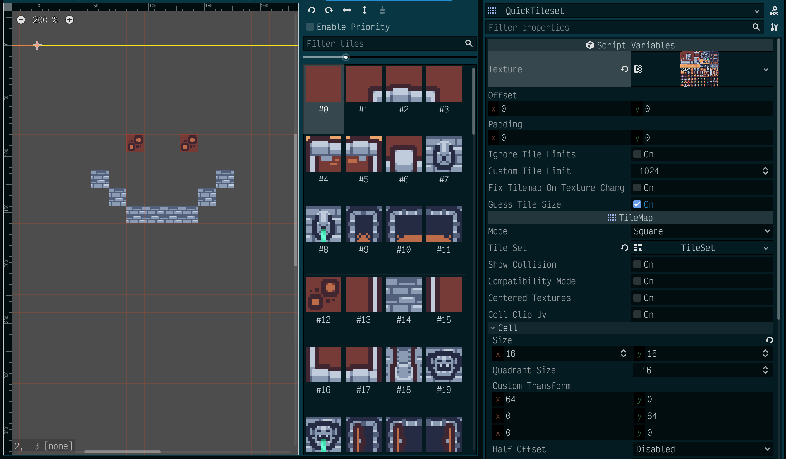

# QuickTileset (for [Godot Engine](https://godotengine.org/))

A quick and dirty script for creating complete [Godot](https://godotengine.org/) `TileSet`s without the hours of endless clicking.

Now available in the [Godot Engine Asset Library](https://godotengine.org/asset-library/asset): [https://godotengine.org/asset-library/asset/1400](https://godotengine.org/asset-library/asset/1400)

Version: 0.1.2

License: MIT

## Background

I needed a quick way of trying out various pre-made tile sets (such as the [large](https://www.kenney.nl/assets/bit-pack) [sets](https://www.kenney.nl/assets/micro-roguelike) produced by [Kenney](https://www.kenney.nl/)) but constructing them by hand in the Godot editor was tedious and error prone.

This script takes a texture containing a tile set, configure the cell size (and optional offset and per-cell padding) and it will quickly (and automatically) create a full `TileSet` of all tiles in the texture, which is then added to the `TileMap` node.

> A minimalist version of this addon is available as a gist: [https://gist.github.com/paradrogue/634f1ee5b66968846478bf7bf21904c8](https://gist.github.com/paradrogue/634f1ee5b66968846478bf7bf21904c8)

## Features

- Automatically creates a `TileSet` containing single tiles for each tile in the texture when the texture is added.
- Automatically updates the `TileSet` if the texture, offset, padding and/or cell size changes.
- The script can be detached after the `TileSet` has been configured.
- The script can be re-added non-destructively, as long as no changes are made.
- If the script it detached, the `TileSet` can be treated like a normal `TileSet` resource.
- The script attempts to automatically discern the cell size iff the filename contains a "common" tile size in the form `<width>x<height>`, *e.g.* `grass_16x16.png` will be interpreted to contain 16×16 tiles.  Sizes assumed "common" are: 8, 12, 16, 18, 24, 32, 48, 64, 72, 96, 128, 192, 256.  Dimensions are not required to be square, *i.e.* `village_128x64.png` would also be automatically discovered with a cell size of 128×64 pixels. If the cell size is incorrectly determined from the texture's filename, the `cell size` can be corrected manually.

## Known limitations

- Generates an embedded `TileSet` resource only.  Cannot generate an external `TileSet` resource, although the generated resource can be saved to the project as normal.
- Generates single tiles only.  Cannot generate tiles that span multiple cells.
- Tiles will be created for each cell in the texture, even if it is not expected or designed to be used.
- If the `TileSet` has been customised after the script has been detached, it *may* no longer contain the customisations if regenerated, especially if the changes applied were to the tiles themselves.
- If the script is reattached after it has been detached, it will no longer be aware of the original texture, offset or padding.  The previously generated  `TileSet` will remain until the `TileMap` is updated.
- A *soft* limit of 1024 tiles is in place.  This is to prevent system lockup as the generator script uses the main Godot thread. This limit can be customised and disabled if required.  Use with caution.
- If the cell size cannot be determined from the filename, the last-used cell size will remain.  This can be customised.
- No collisions, occlusion, navigation, *etc.* are generated.
- Rectangular 2D tiles only.
- Only tested with the following versions of Godot Engine:
  - 3.4.4.stable (MacOS)

## How to use it

1. Download the script `QuickTileset.gd` and add it to the project.
2. Create a `Tilemap` node in the scene.
3. Adjust the `Tilemap`'s Cell Size property to fit the cell size of the tiles in the texture.
4. Attach the `QuickTileset.gd` script to the new `Tilemap` node.
5. Adjust the `Offset` and `Padding` script variables as required. Negative values are allowed to cater for overlapping tiles.
6. Drag and drop (or otherwise `load`) the tile set texture into the `Tileset texture` script variable.
7. Use the generated `TileSet` within the `TileMap` as normal.
8. Once finished, the script can be removed from the `TileMap` node.  The `TileSet` will remain as an embedded resource of the `TileMap` node.

An optional `QuickTileset.tscn` is also included if you want a simple scene to instance.

## Version history

`0.1.2` - 2022-08-03
- Added configuration warning.

`0.1.1` - 2022-07-27
- Added examples.
- Available in the Asset Library (as of 2022-08-01)

`0.1.0` - 2022-07-24
- Initial release.